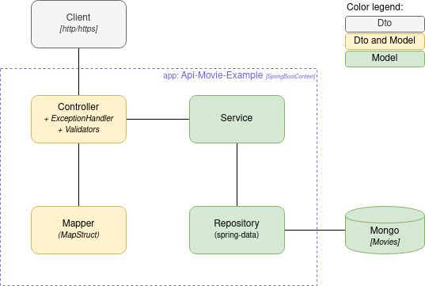

# api-movies-example

## Architecture

[back to main](../README.md)

---

## Table of contents

- [Controllers](controllers.md)
- [Services](services.md)
- [Mappers](mappers.md)
- [Validations](validations.md)
- [Exceptions](exceptions.md)
- [Tests](tests.md)

---

---

[back to top](#api-movies-example)
