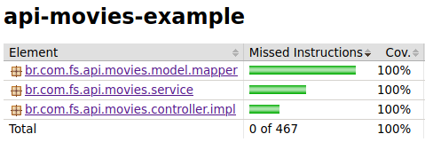

# api-movies-example

## Tests

[back to Architecture](architecture.md)

---

### Coverage:

[JaCoCo](https://www.eclemma.org/jacoco/) was used to collect coverage data during the execution of the tests

---

### Templates:

To generate random objects the framework was used: [java-faker](https://github.com/DiUS/java-faker)

**About `java-faker`**

- [Home](https://github.com/DiUS/java-faker)
- [JavaDoc](http://dius.github.io/java-faker/apidocs/index.html)
- [GitHub](https://github.com/DiUS/java-faker)
- [Example](https://java-faker.herokuapp.com/)
- [Tutorial](https://www.baeldung.com/java-faker)

---

---

[back to top](#api-movies-example)
